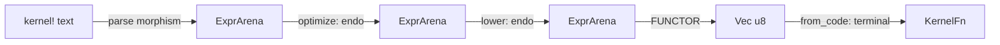

# The Assembler as a Functor: Formalizing the Codegen Pipeline

## 1. Why this doc exists

The compiler back-end is a pipeline, and everyone who has read it knows that
intuitively. What this doc does is make the pipeline *legible in the type
system* instead of implicit in a family of hand-composed entry points. The
payoff is not aesthetic: the categorical structure tells us exactly which
axes of variation are orthogonal, and therefore which functions want to be
one builder rather than eight.

The claim is narrow and checkable:

- The optimizer and the lowering passes are **endomorphisms** on the arena.
- The back-end (schedule → register-allocate → encode) is **one functor**
  from arena-DAGs to machine code, instantiated once per ISA.
- Producing an executable is a **terminal, effectful morphism** (mmap) with
  no inverse.
- Everything downstream of the front-end parse is **string-free**: the "assembly
  language" is `OpKind`/`ScheduledOp` enums and the output is `Vec<u8>` flipped
  to `PROT_EXEC`. There is no textual round-trip and no re-parse.

## 2. The three arrow classes



| Class | Stages | Signature | Composition law |
|-------|--------|-----------|-----------------|
| **Parse morphism** (one-way) | lexer → parser → sema | `Text → Arena` | The only place strings exist |
| **Endomorphism on `Arena`** | e-graph optimize; transcendental / gather / reduce lowering | `Arena → Arena` (root ↦ root) | Free monoid: order matters, object type is invariant |
| **The functor** (changes category) | `arena_to_schedule` → `regalloc::linear_scan` → `emit_*` | `Arena → [ScheduledOp] → Vec<u8>` | One functor; ISAs are its *components* |
| **Terminal morphism** (effectful) | `ExecutableCode::from_code` | `Vec<u8> → KernelFn` | mmap + mprotect; no inverse |

### 2.1 The endomorphisms are already abstracted

`rebuild_arena` (`pixelflow-ir/src/backend/emit/lowering.rs`) is a
post-order DAG rebuild whose only parameter is a `lower` hook; it is the
shared skeleton behind `expand_transcendentals`, `expand_gather`, and
`expand_reduce`. Each pass is an `Arena → Arena` map that preserves sharing
(a DAG stays a DAG). The e-graph optimizer (`pixelflow-compiler/src/optimize.rs`)
is the same shape at a coarser grain: equality-saturation rewrites morphisms
while the object type stays `ExprArena`.

That these are endomorphisms is *why* their ordering is the only thing that
matters and *why* they compose freely — a fact the lowering module already
depends on: the optimizer runs first (still reasoning about `sin`/`cos`
algebraically), then transcendental lowering expands `Sin` into
`Mul`/`Add`/… primitives, all without ever leaving the arena.

### 2.2 The functor already has a single definition

`compile_dag_via_backend<B: IsaBackend>`
(`pixelflow-ir/src/backend/emit/mod.rs`) is the architecture-independent
functor definition: schedule, register allocation, frame layout, and Select
short-circuit control flow live here *once*. The `IsaBackend` trait is the
functor's component at each object — x86-64, aarch64, and AVX-512 supply only
the leaf encodings (instruction bytes, branch fixups, prologue/epilogue). The
functor law we care about — *"the code for a compound op is the code for its
parts, glued"* — holds because every backend runs the same driver; only the
leaf `emit_*` differs.

The encoders themselves are string-free by construction: `emit_addps(code,
dst, src)` pushes `0x0F, 0x58, …` onto a `Vec<u8>`. Registers are the newtype
`Reg(pub u8)`; ops are `OpKind`. A grep of `x86_64.rs` for `format!`,
`write!`, `String`, `&str`, `asm!`, `.parse()` returns nothing.

## 3. The smell: the pipeline is implicit

Today the back-end exposes a family of top-level entry points in
`emit/mod.rs`:

```
compile_arena
compile_arena_dag
compile_arena_dag_with_ctx
compile_arena_dag_scanline
compile_arena_dag_scanline_hoisted
compile_scanline_hoisted
compile_scanline_from_schedule
compile_from_schedule
```

This is the "name vs namespace" smell that `CLAUDE.md` explicitly calls out:
an accreting family of `*_with_ctx`, `*_scanline`, `*_hoisted` variants is the
cue to introduce a struct/builder. Each of these functions is *the same
three-stage pipeline with a different combination of switches hardcoded into
its name*. Every new axis multiplies the family.

### 3.1 The key finding: the suffixes are parameters, not arrows

The reason the collapse is safe is that none of the three suffix axes is a
genuine new arrow. Each is a **parameter of an arrow that already exists**:

| Suffix | What it actually varies | Which arrow it parameterizes |
|--------|-------------------------|------------------------------|
| `_with_ctx` / default | `EmitCtx.max_regs` — the scratch-register budget before spilling (an ML/tuning knob) | the **regalloc** step of the functor |
| `_hoisted` | the scope-partition predicate (`Variance → bool`) fed to `arena_to_hoisted_schedule` | the **schedule** step (`Arena → [ScheduledOp]`) |
| `_scanline` | the calling convention / ABI (x0 = X-array pointer, no ctx register, no bound-memory Gather) vs the per-batch ctx kernel | the **target ABI** of the functor |

Hoisting is the axis most at risk of being mismodeled, so to be explicit:
**hoisting is a scheduling parameter, not a fourth arrow.**
`arena_to_hoisted_schedule` produces a `HoistedSchedule` — the *same*
schedule, partitioned into a setup phase (loop-invariant, held in
callee-saved registers) and a loop phase, by a variance predicate. Flat
scheduling (`arena_to_schedule`) is simply the trivial partition where the
setup phase is empty. Both land in `[ScheduledOp]`; the arena is untouched
and the backend is unchanged. So hoisting parameterizes `Arena → Schedule`
and nothing else.

Because all three axes are independent parameters of a *fixed* 3-stage
pipeline, the eight functions are enumerating points in a product
`{budget} × {scope partition} × {ABI}`. That is precisely the shape that
should be a builder, not a function-per-point.

## 4. The proposal: make the pipeline a value

Two of the four axes are resolved at **compile time** (monomorphized, no
runtime dispatch — consistent with "types are shaders"); two are runtime
values:

```
Pipeline  =  Compile<Abi, Isa>        // compile-time: monomorphized, no dispatch
                × [ArenaPass]          // runtime: arena endomorphisms, composed
                × ScopePartition       // runtime: schedule partition predicate
                × EmitCtx              // runtime: register budget (own axis)
```

Concretely, a builder whose ABI and ISA are **type parameters** replaces the
name suffixes:

```rust
// Illustrative shape, not final API.
// Abi and Isa are type parameters — monomorphized, exactly like the existing
// `compile_dag_via_backend<B: IsaBackend>`. No runtime `match` on ABI.
Compile::<Scanline, Aarch64>::new()
    .pass(optimize)                                  // ArenaPass: endomorphism
    .pass(expand_transcendentals)                    // another, composed
    .scope(ScopePartition::hoist(default_hoist_predicate)) // was `_hoisted`
    .budget(EmitCtx::with_max_regs(10))                    // was `_with_ctx`
    .run(&arena, root)            // drives schedule -> regalloc -> emit -> from_code
```

- **`Abi`** — a **trait**, resolved at compile time (decided: see §6). It
  supplies the calling-convention-specific pieces — input-register mapping,
  prologue/epilogue shape, and op legality (e.g. scanline forbids
  bound-memory Gather). Composes with `Isa` in the driver:
  `run<A: Abi, B: IsaBackend>`. The `_scanline` suffix becomes the type
  argument `Scanline`; the per-batch ctx kernel is the default ABI type.
- **`ArenaPass`** — one trait for the endomorphisms, generalizing
  `rebuild_arena`'s hook. `optimize` and each `expand_*` are instances;
  composition is `.then()`. This makes the free-monoid structure a value.
- **`ScopePartition`** — the schedule-partition predicate
  (`Variance → bool`) fed to the schedule step. Flat scheduling is the empty
  partition; `hoist(pred)` is the two-phase setup/loop split. The `_hoisted`
  suffix becomes this runtime value.
- **`EmitCtx`** — its **own** runtime axis (`.budget(...)`), *not* folded into
  scheduling (decided: see §6). It parameterizes regalloc/spilling and is the
  ML tuning knob. The `_with_ctx` suffix becomes this value.
- **`Isa` / `IsaBackend`** — unchanged. Already the functor component; stays
  exactly as is.

### 4.1 What this buys

- **The functor laws become property-testable.** "Emitting a compound op =
  gluing the emitted parts" can be checked directly at the `[ScheduledOp] →
  Vec<u8>` boundary, and "every ISA is the same functor" is enforced by all
  backends going through one driver. Today those laws hold only by
  discipline.
- **New axes stop multiplying names.** A future scope lattice
  ({pixel, scanline, tile, frame}) is a richer `ScopePartition`, not a
  combinatorial explosion of `compile_*` functions.
- **The categorical model and the `CLAUDE.md` cleanup are the same refactor**
  — the model is what tells you the eight functions are one builder over three
  axes.

## 5. Migration plan

Staged so each step keeps `cargo test --workspace` green and is independently
revertible:

1. **Introduce `ArenaPass`** — a trait (or type alias) for `Arena → Arena`
   with `.then()` composition; retrofit `optimize` and the `expand_*` passes
   as instances. No call-site changes yet.
2. **Introduce `ScheduleStrategy`** — a struct holding `{ abi, scope
   partition, EmitCtx }`. Route `arena_to_schedule` and
   `arena_to_hoisted_schedule` behind it, with flat = empty partition.
3. **Introduce `Compile` builder** — `.pass().abi().scope().budget().run()`,
   implemented by delegating to the *existing* `compile_dag_via_backend`
   driver. Nothing about codegen changes; this is pure re-surfacing.
4. **Fold the `compile_*` family into thin shims** that construct the
   equivalent `Compile` and call `.run()`. Keep the shims through one release
   so downstream code (and benches) migrate incrementally.
5. **Delete the shims** once no caller remains, leaving one builder.

Non-goals: no change to instruction encodings, register allocation, the
Select short-circuit, or the front-end parse. This is a re-surfacing of the
existing pipeline, not a rewrite of any stage.

## 6. Resolved decisions

- **`EmitCtx` is its own axis.** It parameterizes the regalloc/spill step, not
  scheduling, so it stands beside `ScopePartition` as `.budget(...)` rather
  than being folded into a scheduling struct. It stays the ML register-budget
  knob.
- **`Abi` is a trait, resolved at compile time.** We want compile-time
  polymorphism (monomorphization, no runtime dispatch), mirroring the existing
  `compile_dag_via_backend<B: IsaBackend>`. So the driver is generic over both
  `Abi` and `Isa` (`run<A: Abi, B: IsaBackend>`); the ABI's op-legality checks,
  input-register mapping, and prologue/epilogue become associated behavior on
  the `Abi` type rather than a runtime `match`. `Scanline` and the per-batch
  ctx kernel are distinct `Abi` types. This is the one axis that touches both
  the schedule (legal ops) and the backend (prologue/ABI), so keeping it a
  compile-time type — not a runtime field — is what lets the driver reject
  illegal combinations at monomorphization time instead of at runtime.

## 7. Remaining open question

- **Does `Abi` subsume the ABI-specific parts currently inside `IsaBackend`
  (prologue/epilogue), or sit orthogonal to it?** Scanline is presently
  aarch64-only (`#[cfg(target_arch = "aarch64")]`) and its prologue/epilogue
  lives in the backend. When `Abi` becomes its own trait, the prologue/epilogue
  responsibility should move to (or be shared with) `Abi`, since it is a
  calling-convention property, not an instruction-encoding one. Settle the
  exact `Abi` / `IsaBackend` boundary when the trait is cut.
