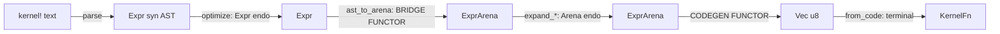

# The Assembler as a Functor: Formalizing the Codegen Pipeline

## 1. Why this doc exists

The compiler back-end is a pipeline, and everyone who has read it knows that
intuitively. What this doc does is make the pipeline *legible in the type
system* instead of implicit in a family of hand-composed entry points. The
payoff is not aesthetic: the categorical structure tells us exactly which
axes of variation are orthogonal, and therefore which functions want to be
one builder rather than eight.

The claim is narrow and checkable:

- The optimizer and the lowering passes are **endomorphisms** on the arena.
- The back-end (schedule → register-allocate → encode) is **one functor**
  from arena-DAGs to machine code, instantiated once per ISA.
- Producing an executable is a **terminal, effectful morphism** (mmap) with
  no inverse.
- Everything downstream of the front-end parse is **string-free**: the "assembly
  language" is `OpKind`/`ScheduledOp` enums and the output is `Vec<u8>` flipped
  to `PROT_EXEC`. There is no textual round-trip and no re-parse.

## 2. The arrow classes

There are **two endomorphism monoids at two different altitudes**, separated
by a bridge functor, then the codegen functor, then the terminal mmap. The
three representations are distinct and must not be conflated:

1. **Source AST `Expr`** (`syn`-based, `pixelflow-compiler/src/ast.rs`) — what
   the parser, sema, and `optimize` operate on.
2. **`ExprArena`** (`pixelflow-ir/src/arena.rs`) — the codegen IR the
   *assembler* operates on. (The e-graph uses its own internal
   representation, bridged in and out of `Expr` at the optimizer boundary.)
3. **Machine code** `Vec<u8>` → `KernelFn`.



| Class | Stages | Signature | Composition law |
|-------|--------|-----------|-----------------|
| **Parse morphism** (one-way) | lexer → parser → sema | `Text → Expr` | The only place strings exist |
| **Front-end endomorphism** on `Expr` | `optimize` (structural + e-graph) | `Expr → Expr` | Free monoid at the source-AST altitude |
| **Bridge functor** (changes category) | `ir_bridge::ast_to_arena` | `Expr → ExprArena` | Lowers source AST into codegen IR |
| **Back-end endomorphism** on `Arena` | `expand_transcendentals` / `expand_gather` / `expand_reduce` | `Arena → Arena` (root ↦ root) | Free monoid at the IR altitude; sharing-preserving |
| **Codegen functor** (changes category) | `arena_to_schedule` → `regalloc::linear_scan` → `emit_*` | `Arena → [ScheduledOp] → Vec<u8>` | One functor; ISAs are its *components* |
| **Terminal morphism** (effectful) | `ExecutableCode::from_code` | `Vec<u8> → KernelFn` | mmap + mprotect; no inverse |

The "assembler" this doc is about is the **back-end**: everything from
`ExprArena` rightward. The front-end `Expr` monoid and the bridge are named
here for completeness and to prevent the (tempting, wrong) collapse of
`optimize` into the arena passes — they are at a different altitude, on a
different type, in a different crate.

### 2.0 Current vs. target: the optimizer belongs on the IR

The two-monoid structure above is the **current** state, and it is a wart, not
a law. The optimizer lives on the source AST for historical reasons only:

- `optimize`'s input/output is `AnalyzedKernel.def.body: Expr` (syn AST).
- But e-graph extraction *already builds an arena internally*
  (`choices_to_arena` / `ExtractedDAG` in `pixelflow-search`), then
  `dag_to_expr` (`optimize.rs`) converts it **back** to syn `Expr` — purely so
  the proc-macro `codegen::emit(AnalyzedKernel)` can consume it.

So syn-`Expr` is the handoff between `optimize` and `codegen`, and
`dag_to_expr` is a round-trip that exists only because codegen speaks AST
instead of IR. The arena we want is created and then discarded on every
compile.

**Target architecture** (what `CLAUDE.md`'s "ExprArena is the sole IR
representation everywhere" actually asks for): move the bridge up to right
after sema, and everything downstream is one representation.


Then `optimize` and `expand_*` are a **single** `ExprArena → ExprArena`
endomorphism monoid, `dag_to_expr` is deleted, and the source AST exists only
between parse and the bridge. This subsumes `ArenaPass`: `optimize` becomes a
member of the same monoid rather than a separate altitude.

The cost is not uniform across the two consumers of the handoff:

- **Optimizer ingestion** (syn `Expr` → e-graph): *moderate*. Replace
  `expr_to_egraph(&Expr)` with arena ingestion; the DAG/arena machinery
  already exists. Kills `dag_to_expr`.
- **Proc-macro codegen** (`codegen::emit` + `codegen/emitter.rs`, ~1200 LOC):
  *large*. It emits the Manifold **type-tree** TokenStream (`Sqrt<Add<…>>`)
  by walking syn `Expr`; consuming the arena means re-targeting that walk. This
  is the real cost center and deserves its own design pass.

Because syn-`Expr` is the *shared* handoff, you cannot move the optimizer onto
the IR without also moving codegen — otherwise `dag_to_expr` stays. So this is
staged (see §5): land the back-end `ArenaPass` first, then optimizer
ingestion, then codegen-on-arena last.

### 2.1 The back-end endomorphisms are already abstracted

`rebuild_arena` (`pixelflow-ir/src/backend/emit/lowering.rs`) is a
post-order DAG rebuild whose only parameter is a `lower` hook; it is the
shared skeleton behind `expand_transcendentals`, `expand_gather`, and
`expand_reduce`. Each pass is an `ExprArena → ExprArena` map that preserves
sharing (a DAG stays a DAG). These three — and *only* these three — are the
back-end endomorphism monoid that `ArenaPass` (§4) unifies.

That they are endomorphisms is *why* their ordering is the only thing that
matters and *why* they compose freely. Note the front-end `optimize` runs
*before* the bridge (still reasoning about `sin`/`cos` algebraically on the
source AST); transcendental lowering then expands `Sin` into `Mul`/`Add`/…
primitives *after* the arena exists. The two never share an altitude, which
is exactly why they are two monoids and not one.

> **Correction (during design):** an earlier draft lumped `optimize` in with
> the `expand_*` passes as "endomorphisms on `Arena`." That was wrong.
> `optimize`'s public boundary is `AnalyzedKernel` and it transforms
> `def.body: Expr` — the source AST — not `ExprArena`. Reading the code
> caught it before any trait was cut. The corrected model is strictly better:
> `ArenaPass` is now a tight, single-crate (`pixelflow-ir`) abstraction over
> the three `expand_*` passes, with no compiler-crate entanglement.

### 2.2 The functor already has a single definition

`compile_dag_via_backend<B: IsaBackend>`
(`pixelflow-ir/src/backend/emit/mod.rs`) is the architecture-independent
functor definition: schedule, register allocation, frame layout, and Select
short-circuit control flow live here *once*. The `IsaBackend` trait is the
functor's component at each object — x86-64, aarch64, and AVX-512 supply only
the leaf encodings (instruction bytes, branch fixups, prologue/epilogue). The
functor law we care about — *"the code for a compound op is the code for its
parts, glued"* — holds because every backend runs the same driver; only the
leaf `emit_*` differs.

The encoders themselves are string-free by construction: `emit_addps(code,
dst, src)` pushes `0x0F, 0x58, …` onto a `Vec<u8>`. Registers are the newtype
`Reg(pub u8)`; ops are `OpKind`. A grep of `x86_64.rs` for `format!`,
`write!`, `String`, `&str`, `asm!`, `.parse()` returns nothing.

## 3. The smell: the pipeline is implicit

Today the back-end exposes a family of top-level entry points in
`emit/mod.rs`:

```
compile_arena
compile_arena_dag
compile_arena_dag_with_ctx
compile_arena_dag_scanline
compile_arena_dag_scanline_hoisted
compile_scanline_hoisted
compile_scanline_from_schedule
compile_from_schedule
```

This is the "name vs namespace" smell that `CLAUDE.md` explicitly calls out:
an accreting family of `*_with_ctx`, `*_scanline`, `*_hoisted` variants is the
cue to introduce a struct/builder. Each of these functions is *the same
three-stage pipeline with a different combination of switches hardcoded into
its name*. Every new axis multiplies the family.

### 3.1 The key finding: the suffixes are parameters, not arrows

The reason the collapse is safe is that none of the three suffix axes is a
genuine new arrow. Each is a **parameter of an arrow that already exists**:

| Suffix | What it actually varies | Which arrow it parameterizes |
|--------|-------------------------|------------------------------|
| `_with_ctx` / default | `EmitCtx.max_regs` — the scratch-register budget before spilling (an ML/tuning knob) | the **regalloc** step of the functor |
| `_hoisted` | the scope-partition predicate (`Variance → bool`) fed to `arena_to_hoisted_schedule` | the **schedule** step (`Arena → [ScheduledOp]`) |
| `_scanline` | the calling convention / ABI (x0 = X-array pointer, no ctx register, no bound-memory Gather) vs the per-batch ctx kernel | the **target ABI** of the functor |

Hoisting is the axis most at risk of being mismodeled, so to be explicit:
**hoisting is a scheduling parameter, not a fourth arrow.**
`arena_to_hoisted_schedule` produces a `HoistedSchedule` — the *same*
schedule, partitioned into a setup phase (loop-invariant, held in
callee-saved registers) and a loop phase, by a variance predicate. Flat
scheduling (`arena_to_schedule`) is simply the trivial partition where the
setup phase is empty. Both land in `[ScheduledOp]`; the arena is untouched
and the backend is unchanged. So hoisting parameterizes `Arena → Schedule`
and nothing else.

Because all three axes are independent parameters of a *fixed* 3-stage
pipeline, the eight functions are enumerating points in a product
`{budget} × {scope partition} × {ABI}`. That is precisely the shape that
should be a builder, not a function-per-point.

## 4. The proposal: make the pipeline a value

Two of the four axes are resolved at **compile time** (monomorphized, no
runtime dispatch — consistent with "types are shaders"); two are runtime
values:

```
Pipeline  =  Compile<Abi, Isa>        // compile-time: monomorphized, no dispatch
                × [ArenaPass]          // runtime: arena endomorphisms, composed
                × ScopePartition       // runtime: schedule partition predicate
                × EmitCtx              // runtime: register budget (own axis)
```

Concretely, a builder whose ABI and ISA are **type parameters** replaces the
name suffixes:

```rust
// Illustrative shape, not final API.
// Abi and Isa are type parameters — monomorphized, exactly like the existing
// `compile_dag_via_backend<B: IsaBackend>`. No runtime `match` on ABI.
Compile::<Scanline, Aarch64>::new()
    .pass(optimize)                                  // ArenaPass: endomorphism
    .pass(expand_transcendentals)                    // another, composed
    .scope(ScopePartition::hoist(default_hoist_predicate)) // was `_hoisted`
    .budget(EmitCtx::with_max_regs(10))                    // was `_with_ctx`
    .run(&arena, root)            // drives schedule -> regalloc -> emit -> from_code
```

- **`Abi`** — a **trait**, resolved at compile time (decided: see §6). It
  supplies the calling-convention-specific pieces — input-register mapping,
  prologue/epilogue shape, and op legality (e.g. scanline forbids
  bound-memory Gather). Composes with `Isa` in the driver:
  `run<A: Abi, B: IsaBackend>`. The `_scanline` suffix becomes the type
  argument `Scanline`; the per-batch ctx kernel is the default ABI type.
- **`ArenaPass`** — one trait for the **back-end** endomorphisms, generalizing
  `rebuild_arena`'s hook. The three `expand_*` passes are its instances;
  composition is `.then()`. This makes the free-monoid structure a value. It
  lives entirely in `pixelflow-ir` and does *not* include the front-end
  `optimize` (which is `Expr → Expr`, a different altitude — see §2).
- **`ScopePartition`** — the schedule-partition predicate
  (`Variance → bool`) fed to the schedule step. Flat scheduling is the empty
  partition; `hoist(pred)` is the two-phase setup/loop split. The `_hoisted`
  suffix becomes this runtime value.
- **`EmitCtx`** — its **own** runtime axis (`.budget(...)`), *not* folded into
  scheduling (decided: see §6). It parameterizes regalloc/spilling and is the
  ML tuning knob. The `_with_ctx` suffix becomes this value.
- **`Isa` / `IsaBackend`** — unchanged. Already the functor component; stays
  exactly as is.

### 4.1 What this buys

- **The functor laws become property-testable.** "Emitting a compound op =
  gluing the emitted parts" can be checked directly at the `[ScheduledOp] →
  Vec<u8>` boundary, and "every ISA is the same functor" is enforced by all
  backends going through one driver. Today those laws hold only by
  discipline.
- **New axes stop multiplying names.** A future scope lattice
  ({pixel, scanline, tile, frame}) is a richer `ScopePartition`, not a
  combinatorial explosion of `compile_*` functions.
- **The categorical model and the `CLAUDE.md` cleanup are the same refactor**
  — the model is what tells you the eight functions are one builder over three
  axes.

## 5. Migration plan

Staged so each step keeps `cargo test --workspace` green and is independently
revertible:

1. **Introduce `ArenaPass`** — a trait (or type alias) for
   `ExprArena → ExprArena` with `.then()` composition; retrofit the three
   `expand_*` passes as instances (pure `pixelflow-ir`, no compiler crate).
   The front-end `optimize` is out of scope — it is `Expr → Expr`. No
   call-site changes yet.
2. **Introduce `ScheduleStrategy`** — a struct holding `{ abi, scope
   partition, EmitCtx }`. Route `arena_to_schedule` and
   `arena_to_hoisted_schedule` behind it, with flat = empty partition.
3. **Introduce `Compile` builder** — `.pass().abi().scope().budget().run()`,
   implemented by delegating to the *existing* `compile_dag_via_backend`
   driver. Nothing about codegen changes; this is pure re-surfacing.
4. **Fold the `compile_*` family into thin shims** that construct the
   equivalent `Compile` and call `.run()`. Keep the shims through one release
   so downstream code (and benches) migrate incrementally.
5. **Delete the shims** once no caller remains, leaving one builder.

Steps 1–5 are **Track A** (re-surface the back-end pipeline as a value): no
change to instruction encodings, register allocation, the Select
short-circuit, or the front-end parse.

**Track B — move the optimizer onto the IR** (§2.0). Independent of Track A.
Scoped down to one step by the feasibility verdict (§5b):

6. **Optimizer ingestion on arena** — feed `ast_to_arena` output to the
   e-graph instead of `expr_to_egraph(&Expr)`; keep `dag_to_expr` so codegen
   is untouched. `optimize`'s numeric path becomes an `ExprArena → ExprArena`
   core. This is the viable, worthwhile part.

   Steps 7–8 (arena-native codegen, delete `dag_to_expr`, retire the
   combinator emitter) are **not owned by this doc** — they are the plan of
   record `docs/plans/2026-07-20-kernel-unification.md` (P2–P6), which resolves
   the opaque surface via arena splicing + Gather + `Dwrt` lowering rather than
   source-AST node bloat (§5b). Track B here stops at step 6; the emitter's
   retirement is tracked there.

## 5b. Feasibility verdict: the arena is a *numeric* IR (Track B step 7 is not viable as stated)

Before cutting codegen over to the arena, a read of `codegen/emitter.rs`
(~1200 LOC) plus `ir_bridge::ast_to_arena` settled the question. Two facts:

**1. Codegen does not build the type-tree — it transliterates to Rust
expression tokens.** The emitter emits `(a + b)`, `x.sqrt()`,
`inner.warp(...)` as ordinary Rust *expressions*; the `Sqrt<Add<…>>` type
only ever materializes as an `rustc`-inferred type via operator/method
overloading on the combinator types. It is never named in the generated
tokens. So "codegen builds the shader type-tree" was itself a
misconception — `rustc` does, from a transliterated expression tree.

**2. Codegen consumes a strict *superset* of what `ExprArena` can represent.**
`ast_to_arena` maps every method to a numeric `OpKind` or errors
(`"Unsupported method"` / `"Unsupported expression type"`), and treats params
as numeric scalars. It has **no vocabulary** for the cases codegen depends on:

| Codegen construct | Arena representation? |
|-------------------|-----------------------|
| Opaque manifold param → generic `M0/M1` + `ContextFree` capture | none (`Var/Const/Param/Buffer` are numeric leaves) |
| Method call on a manifold (`inner.warp(...)`, `mask.select(a,b)`, `.at(...)`) — method *name* + opaque receiver | none (no symbolic-method node) |
| `Expr::Verbatim` — arbitrary syn passthrough (`Foo::default().at(...)`) | none |
| Symbol-kind decisions (manifold taint → `Clone`, `.at`/derivative trait-bound synthesis, `ManifoldBind` vs `Computed`) | none (arena erases scalar-vs-manifold) |
| Literal space (Domain vs Projected → `CtxVar` vs `V(CtxVar)`) | none |

**What this rules out — and what it doesn't.** The *naive* codegen-on-arena
port is not viable: you cannot make the arena hold opaque manifold params,
symbolic method-call chains, and `Expr::Verbatim` syn as **expression node
kinds** without turning the numeric IR into a second source-level AST. That
much stands.

But "keep the combinator emitter forever as a hybrid" — an earlier draft's
conclusion — is *wrong*, and contradicts the plan of record
(`docs/plans/2026-07-20-kernel-unification.md`, "One Kernel Language"). That
plan retires the combinator emitter (P6) and resolves the opaque surface
**without** source-AST node bloat, by routing each opaque case through a
*composition mechanism* rather than an expression node:

| Opaque case | Plan's mechanism (keeps the arena numeric) |
|-------------|--------------------------------------------|
| Manifold params, `.at()`, composition, named structs | **Arena splicing** — `HasIr` fragment accessors; contramap = Var substitution, `Sum` = chained `Add` (P4) |
| Opaque *Rust* manifolds (DiscreteManifold, CachedGlyph) | **Bound buffers / ctx-pointer calls** — the existing Gather pattern, not expressions |
| Jet2/Jet3 (font AA, 3D normals) | **`Dwrt`** symbolic-differentiation lowering in pixelflow-ir (P2) — a numeric op lowered like `expand_transcendentals` |
| Portable / reference semantics | The IR interpreter (`eval.rs`) |

So the arena stays a numeric algebra *and* the emitter still dies — the
opaque surface enters through splicing/Gather/Dwrt, never as source-level
method-call nodes. The full collapse the user asked for is real; it is the
kernel-unification plan's phased **P2–P6**, gated on P0 golden fixtures and
P0.5 e-graph type-stability (both in flight).

**Where this doc sits.** "Assembler as a functor" is about the **back-end**
(`ExprArena → bytes`) that those phases feed. Its concrete near-term
increment, **Track B step 6** (optimizer *ingestion* on the arena), aligns
with the unification plan's `parse → sema → e-graph → ExprArena` pipeline: the
e-graph path is *already* numeric-only (`optimize_via_model`), opaque blocks
*already* bypass it (`optimize_block_preserving_structure`), so feeding
`ast_to_arena` into the e-graph instead of `expr_to_egraph(&Expr)` is a safe,
plan-aligned step. Steps 7–8 (arena-native codegen, delete `dag_to_expr`) are
not a separate track — they are subsumed by kernel-unification P2–P6, which is
the authority on that work. This doc defers to it there.

## 6. Resolved decisions

- **`EmitCtx` is its own axis.** It parameterizes the regalloc/spill step, not
  scheduling, so it stands beside `ScopePartition` as `.budget(...)` rather
  than being folded into a scheduling struct. It stays the ML register-budget
  knob.
- **`Abi` is a trait, resolved at compile time.** We want compile-time
  polymorphism (monomorphization, no runtime dispatch), mirroring the existing
  `compile_dag_via_backend<B: IsaBackend>`. So the driver is generic over both
  `Abi` and `Isa` (`run<A: Abi, B: IsaBackend>`); the ABI's op-legality checks,
  input-register mapping, and prologue/epilogue become associated behavior on
  the `Abi` type rather than a runtime `match`. `Scanline` and the per-batch
  ctx kernel are distinct `Abi` types. This is the one axis that touches both
  the schedule (legal ops) and the backend (prologue/ABI), so keeping it a
  compile-time type — not a runtime field — is what lets the driver reject
  illegal combinations at monomorphization time instead of at runtime.

## 7. Remaining open question

- **Does `Abi` subsume the ABI-specific parts currently inside `IsaBackend`
  (prologue/epilogue), or sit orthogonal to it?** Scanline is presently
  aarch64-only (`#[cfg(target_arch = "aarch64")]`) and its prologue/epilogue
  lives in the backend. When `Abi` becomes its own trait, the prologue/epilogue
  responsibility should move to (or be shared with) `Abi`, since it is a
  calling-convention property, not an instruction-encoding one. Settle the
  exact `Abi` / `IsaBackend` boundary when the trait is cut.
